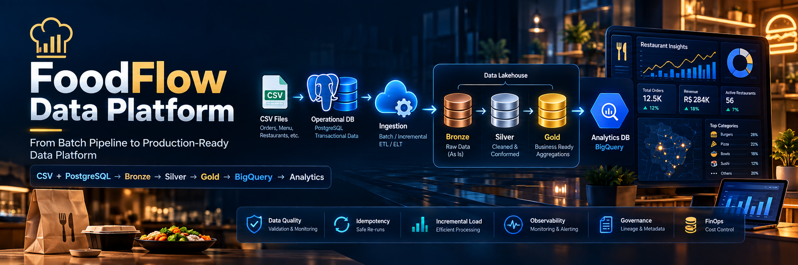

# 🍽️ FoodFlow Data Platform



## From Batch Pipeline to Production-Ready Data Platform

Projeto autoral de Engenharia de Dados que demonstra a evolução de um pipeline batch
desde um MVP funcional até uma plataforma mais próxima de produção.

A ideia central é simples: **não adicionar ferramentas por adicionar**, mas evoluir a
arquitetura à medida que problemas reais aparecem.

---

## 🎯 Contexto

A FoodFlow é uma empresa fictícia com múltiplas unidades.

As fontes iniciais são:

- arquivos de pedidos;
- arquivos de itens dos pedidos;
- dados mestres equivalentes a produto, unidade, estado e país.

O objetivo é centralizar, tratar e disponibilizar os dados para análise no BigQuery.

---

## 🏗️ Arquitetura V1.0

```text
CSV + Dados Mestres
        ↓
foodflow_bronze
        ↓
foodflow_silver
        ↓
foodflow_gold
        ↓
BigQuery Analytics
```

### Bronze
Preserva os dados próximos da origem, com nomenclatura padronizada para o projeto.

### Silver
Aplica limpeza e padronização básica:

- `SAFE_CAST`
- `TRIM`
- `NULLIF`
- padronização de status
- padronização de tipos

### Gold
Modelo analítico simples:

- `dim_product`
- `dim_store`
- `fact_order_items`

---

## ✅ V1.0 concluída

A primeira versão já está funcionando no BigQuery.

Validações executadas:

- contagem consistente entre Bronze e Silver;
- relacionamento entre pedidos e itens;
- integridade com dimensões;
- consultas analíticas executadas com sucesso.

Exemplo de saída analítica já validada:

- 15 pedidos processados;
- receita analítica calculada a partir da camada Gold;
- consultas por data, produto, unidade e canal.

---

## 🚀 Roadmap

- **V1.0** — MVP funcional ✅
- **V1.1** — Data Quality + Schema Validation
- **V1.2** — Idempotência + Reprocessamento
- **V1.3** — Carga incremental
- **V1.4** — Observabilidade + tratamento de falhas
- **V1.5** — Schema Evolution
- **V1.6** — Governança + Segurança
- **V1.7** — FinOps + Performance
- **V2.0** — Alertas + Recomendações

---

## 🧠 Estratégia de evolução

Cada nova versão segue:

```text
Problema
   ↓
Risco
   ↓
Decisão
   ↓
Implementação
   ↓
Resultado
```

---

## 📁 Estrutura

```text
foodflow-data-platform/
├── README.md
├── assets/
├── docs/
│   ├── architecture/
│   ├── screenshots/
│   └── roadmap/
├── sql/
│   ├── 00_setup/
│   ├── 01_bronze/
│   ├── 02_silver/
│   ├── 03_gold/
│   └── 04_validation/
└── .gitignore
```

---

## 👨‍💻 Autor

Reginaldo Rocha  
Engenharia de Dados | Cloud | Observabilidade | FinOps
